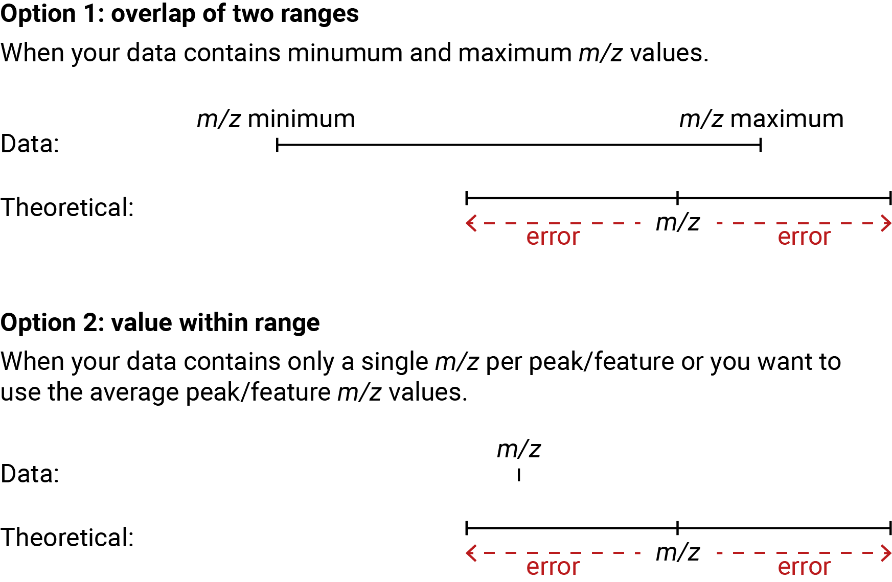

```{r setup, include=FALSE}
knitr::opts_chunk$set(echo = TRUE)
```

# Introduction

This is a tutorial for the annotation of glycans in LC-MS data in R using XCMS, CAMERA and GlycoAnnotateR. Other data processing pipelines (e.g. mzMine) can be used but are not covered in this tutorial. For the annotation step is all that is needed is a dataframe with one row per *m/z*. This tutorial assumes a basic understanding of the XMCS processing pipeline - for a great explanation of LC-MS data processing with XCMS, check out this [tutorial](https://bioconductor.org/packages/release/bioc/vignettes/xcms/inst/doc/xcms.html). 


This tutorial will use example data, which you can find here on Github under 'inst/example_data'. The .mzML files should be downloaded and unzipped. The data consists of three mzML files. All contain HILIC-ESI-Orbitrap MS data. The same mixture of commercial oligosaccharide standards was run three times in negative mode: once with full MS only and twice with DDA-MS/MS. 

We will first set up the environment by loading the required packages. xcms is used for the data processing (peak picking and grouping, chromatogram extraction etc) and CAMERA is used for isotope detection. xcms can be installed from BioConductor using BiocManager. 

# Load required packages

```{r install CAMERA, echo=FALSE, include=FALSE}
library(BiocManager)
BiocManager::install('CAMERA', update = T)

```


```{r import packages, message=FALSE, warning=FALSE}
library(GlycoAnnotateR)
library(dplyr)
library(xcms)
library(CAMERA)
library(ggplot2)
library(ggrepel)
library(scales)
library(stringr)
```

# Pre-processing the data
## Import and prepare the data

### Import data
Now we import the mzML data files as an OnDiskMSnExp object (`all_data`) with an associated phenodata (i.e. metadata) table. It is important that you download the example files _**manually**_ from [Github](https://github.com/margotbligh/GlycoAnnotateR/tree/master/inst/extdata), they can be found at 'inst/extdata'. The data files should be 180-220 MB - if they are smaller than this, they have been downloaded incorrectly. Download them from Github manually by clicking on the individual files and then pressing the download button.


```{r import data}
#get filepaths of mzML files
#change as necessary to match your directory structure
fp <- dir('../inst/extdata', pattern = 'mzML$', full.names = T)

#make a metadata df
pd <- data.frame(sample_name = gsub(".mzML|.*1[78]_", "", basename(fp)),
                 frag = str_split_i(basename(fp), "_", 4),
                 sample_type = str_split_i(basename(fp), "_", 3))

#print the metadata df                 
pd

#read in data with metadata df as phenodata
all_data <- readMSData(files = fp, 
                       pdata = new("NAnnotatedDataFrame", pd),
                       mode = 'onDisk')
```

### Filter by retention time

We will now filter the data to only retain scans between 1 minute (sample injection) and 30 minutes (solvent B ramped up to re-condition the column). This is not strictly necessary but increases the speed of processing by dropping unneeded data.

```{r filter retention time}
#filter retention time
all_data <- filterRt(all_data, rt = c(1*60, 30*60))
```


### Split data

We will now split the data in two. One object has only MS1 scan events (data_ms1) and one object has all scan events (MS1 and MS2). CAMERA peak grouping by retention time for isotope picking requires objects with only MS1 scans. 

```{r split data}
#make MS1 only data object
data_ms1 <- all_data[all_data@featureData@data$msLevel == 1]
data_ms2 <- all_data
```

## Peak picking, refining and grouping

### Peak picking

Peak picking is done with the CentWave algorithm, for details see [Tautenhahn et al., 2008](https://bmcbioinformatics.biomedcentral.com/articles/10.1186/1471-2105-9-504). CentWave parameters should be optimised for each dataset - this can be done with the [IPO package](https://bioconductor.org/packages/release/bioc/html/IPO.html). 

We will only perform peak picking on the MS1 object. Later, MS2 spectra associated with MS1 features annotated as glycans will be extracted, using the MS1 peaks.

```{r pick peaks}
#create parameter object
cwp <- CentWaveParam(ppm = 4, peakwidth = c(10, 60))
#pick peaks 
data_ms1_pks <- findChromPeaks(data_ms1, cwp)
```


Peak picking should always be optimised and checked extensively, as this will have a massive impact on the downstream data interpretation. Here, we will check an example chromatogram for a dihexose [M+Cl]- adduct. We will quickly use glycoPredict from GlycoAnnotateR to get the correct *m/z* value.
```{r extract chr, warning=FALSE, message=FALSE}
#calculate m/z value for dihexose Cl adduct
df_dihexose <- glycoPredict(param = glycoPredictParam(dp = c(2,2),
                                                       polarity = 'neg',
                                                       adducts = 'Cl'))

#extract chromatogram +- 4 ppm
chr_dihexose_pk <- chromatogram(data_ms1_pks,
                                mz = c(df_dihexose$mz-ppm_to_mz(df_dihexose$mz, 4), 
                                       df_dihexose$mz+ppm_to_mz(df_dihexose$mz, 4)))
```

Picked peaks are indicated by the grey shading in the chromatograms. We can see that the peak was picked relatively nicely for the first two samples, but the peak is split in the third sample.

```{r plot chr, fig.show='hold', fig.width=6, fig.height=3}
#plot chromatogram for each sample
plot(chr_dihexose_pk[[1]])
plot(chr_dihexose_pk[[2]])
plot(chr_dihexose_pk[[3]])
```

### Peak merging

We will merge the split peaks using the 'refineChromPeaks' function of xcms. Again, the parameters used will vary for each dataset.

```{r merge neighbouring peaks}
#create parameter object
mpp <- MergeNeighboringPeaksParam(expandRt = 10, minProp = 0.5)
#merge peaks
data_ms1_pks_mg <- refineChromPeaks(data_ms1_pks, mpp)
```

We can see in the chromatograms after peak merging that there is a single dihexose peak picked for each sample. The width of the peak captured in each sample is slightly different. We will not worry about that too much now, as the peaks will be grouped into features in the next step.

```{r check merged chromatograms,  message=FALSE, warning=FALSE, error=FALSE, fig.width=6, fig.height=3, fig.show='hold'}
#extract dihexose chromatogram +- 4 ppm
chr_dihexose_pk_mg <- chromatogram(data_ms1_pks_mg,
                                mz = c(df_dihexose$mz-ppm_to_mz(df_dihexose$mz, 4), 
                                       df_dihexose$mz+ppm_to_mz(df_dihexose$mz, 4)))
#plot chromatogram for each sample
plot(chr_dihexose_pk_mg[[1]])
plot(chr_dihexose_pk_mg[[2]])
plot(chr_dihexose_pk_mg[[3]])
```

### Peak grouping (correspondence)

We will now group the peaks across samples by density into features. In this example there will only be one sample group, as the data contains the same sample run three times. We will double check the parameters first and then group the peaks. Only peaks in 2 of the three runs will be grouped into features.

```{r peak grouping, message=FALSE, warning=FALSE, error=FALSE, fig.width=6, fig.height=4, fig.show='hold'}
#set the parameters for peak grouping
pdp <- PeakDensityParam(sampleGroups = data_ms1_pks_mg$sample_type,
                        minFraction = 2/3, bw = 15, binSize = 0.01)
#check the parameters using the dehexose chromatogram
plotChromPeakDensity(chr_dihexose_pk_mg, 
                     param = pdp,
                     peakPch = 16)

#group peaks
data_ms1_pks_mg_gp <- groupChromPeaks(data_ms1_pks_mg, pdp)
```


### Gap filling 
The final step in our pre-processing workflow is gap filling. This aims to 'rescue' peaks that were not identified in some samples, but which were identified in other samples and have been grouped into a feature. So, for example, there are tetrahexose [M-H]- peaks in samples 1 and 2, but there is not peak in the third sample. 

```{r gap filling prefilled chromatograms, message=FALSE, warning=FALSE, fig.show='hold', fig.width=6, fig.height=4}
#calculate m/z value for deprotonated tetrahexose 
df_tetrahexose <- glycoPredict(param = glycoPredictParam(dp = c(4,4),
                                                         polarity = 'neg',
                                                         adducts = 'H'))

#extract chromatogram +- 4 ppm
chr_tetrahexose_pk <- chromatogram(data_ms1_pks_mg_gp,
                                mz = c(df_tetrahexose$mz-ppm_to_mz(df_tetrahexose$mz, 4), 
                                       df_tetrahexose$mz+ppm_to_mz(df_tetrahexose$mz, 4)))
#plot chromatogram for each sample
plot(chr_tetrahexose_pk[[1]])
plot(chr_tetrahexose_pk[[2]])
plot(chr_tetrahexose_pk[[3]])


```


We apply gap filling using the default parameters, and then re-extract the chromatograms, making sure that filled peaks are included. We can now see that there is a peak in all three samples.

```{r gap filling post filling chromatograms, warning=FALSE, fig.show='hold', fig.width=6, fig.height=4}
#gap filling
data_ms1_pks_mg_gp_fill <- fillChromPeaks(data_ms1_pks_mg_gp)

#extract chromatogram +- 4 ppm
chr_tetrahexose_pkfill <- chromatogram(data_ms1_pks_mg_gp_fill,
                                mz = c(df_tetrahexose$mz-ppm_to_mz(df_tetrahexose$mz, 4), 
                                       df_tetrahexose$mz+ppm_to_mz(df_tetrahexose$mz, 4)),
                                filled = T) #make sure filled is TRUE to include gap filling

#plot chromatograms
plot(chr_tetrahexose_pkfill[[1]])
plot(chr_tetrahexose_pkfill[[2]])
plot(chr_tetrahexose_pkfill[[3]])
```


# Isotope detection

We will now use CAMERA for detection of isotopes. We first need to convert our `XCMSnExp` object to an `xcmsSet` object, which can the be used to construct an `xsAnnotate` object. 

```{r change to xcmsSet, message=FALSE}
#creat xcmsSet object
xset <- as(data_ms1_pks_mg_gp_fill, "xcmsSet")
#set sample names
sampnames(xset) <- pData(data_ms1_pks_mg_gp_fill)$sample_name
#set sample classes/groups
sampclass(xset) <- pData(data_ms1_pks_mg_gp_fill)$sample_type
```

Now we create the `xsAnnotate` object, group peaks by retention time, find isotopes, and generate a feature table containing the isotope information. Features are filtered so that at least 1 sample has an integrated peak area >5e5. 

```{r isotope detection}
#build xsAnnotate object
an <- xsAnnotate(xset)
#group peaks by retention time (full width half maximum)
an <- groupFWHM(an, perfwhm = 0.8)
#find isotopes
an <- findIsotopes(an, ppm = 3)
#get feature list and filter features by intensity values to remove those with only values below 5e5
pl <-getPeaklist(an) %>% 
  filter(if_any(contains("stds"), ~ .x > 5e5))
```

# Annotating the data

## Making the parameter object

We will now move forward with annotating our feature table to identify putative oligosaccharide ions. Here, we will first create the `glycoPredictParam` object, and then annotate the data. These two steps can be done in one, but we will first look at and understand the `glycoPredictParam` object.

```{r creating the parameter object}
#create the glycoPredictParam object
gpp <- glycoPredictParam(
  #degree of polymerisation range, here monomer to tetramer 
  dp = c(1,4), 
  #ionisation polarity
  polarity = "neg", 
  #ionisation type (affects adduct types)
  ion_type = "ESI", 
  #scan range during acquisition (here for MS1 scans)
  scan_range = c(175,1400),
  #expected modifications
  modifications = c("alditol", 
                    "sulfate",
                    "omethyl",
                    "anhydrobridge"),
  #maximum average number of modifications per monomer
  nmod_max = 1,
  #adducts
  adducts = c("H", "Cl"))
gpp
```

## Calculating compositions

We can now use parameters defined in the `glycoPredictParam` object to 'predict' (or rather calculate) all possible glycans. You can directly run `glycoAnnotate` to annotate your peak list using the parameters, which will call `glycoPredict` in the background, but here we will demonstrate the output of `glycoPredict` by running it separately. 

```{r build calculated df, warning=FALSE}
#create a table of theoretical glycans and their ions
pred_df <- glycoPredict(param = gpp)
```

By default we have selected IUPAC naming and long output format, so glycan compositions are named with IUPAC abbreviations and there is one row per adduct/ion. 309 adducts from 134 possible compositions are calculated based on the constraints of the input parameters.

```{r print number adducts comps}
#print the number of adducts and compositions
print(paste('There are', nrow(pred_df), 
            'adducts/ions from', 
            length(unique(pred_df$`IUPAC name`)),
            'different compositions'))
```

There are 8 columns in the output:

* dp = the degree of polymerisation (oligomer length)
* mass = the monisotopic exact mass of the neutral oligosaccharide
* formula = the sum formula of the neutral oligosaccharide 
* IUPAC name = the name of the oligosaacharide, using common abbreviations from IUPAC (see [here](https://margotbligh.github.io/GlycoAnnotateR/)) for a summary of the naming
* ion = the adduct of the ion
* mz = the mass-to-charge ratio of the ion (*m/z*)
* ion_formula = the sum formula of the ion formed by the oligosaccharide
* charge = the charge state of the adduct

```{r inspect comp table}
#inspect the output
head(pred_df)
```

## Annotate features

We will now annotate the feature list generated after isotope detection using the parameters we defined. Because our feature list has minimum and maximum *m/z* values, we can use those values for annotation against theoretical values (the range for each theoretical values is created as the value +- the error in ppm or Da). This is done by checking for overlap of two ranges. For peak/feature lists with only an *m/z* value (mean or otherwise defined), or if you would like to only use this value, we can supply just the *m/z* column name. This will annotate by checking if the value is within the range of the theoretical values. The below figure summarises the two types of annotation possible:

```{r image matching types, out.width = "400px", echo=FALSE}

```

We will try both types of annotation here to see how they work and how the output differs. We will choose NOT to collapse the annotations (i.e. if a feature receives multiple annotations, there will be one row per annotation) at this point so that we can look at all of the output information. Collapsing of annotations (so that there is one row per feature, and multiple annotations for the same feature are comma separated) can be done during this step or later. 

### Overlap of two ranges


Note that here we are supplying again the `glycoPredictParam` object, to demonstrate that annotation can be a single step process. However, given that we have already run `glycoPredict`, we could alternatively have supplied `pred_table = pred_df` and not provide a value for `param`.

```{r overlap two ranges, message=FALSE, warning=FALSE}
#annotation is performed
pl_annot_overlap2ranges <- glycoAnnotate(
  #feature or peak list to be annotated
  data = pl,
  #glycoPredictParam object 
  param = gpp,
  #error unit and value
  error = 2, error_units = 'ppm',
  #should annotations be collapse
  collapse = F,
  #column containing m/z values
  mz_column = 'mz',
  #columns containing minimum and maximimum mz values
  mzmin_column = 'mzmin', mzmax_column = 'mzmax')
```


We can see that the output contains the same columns as the input (feature table), but now also with 7 additional columns - these come from the output of `glycoPredict`. The column containing the theoretical *m/z* values is now named 'mz_pred'. The 'mz' column contains the *m/z* values of the data. The output contains 380 rows - 1 more than the input (381). This means that some features received multiple annotations. 12 features in total received at least one annotation.


```{r output overlap two ranges, collapse=TRUE}
#see output
head(pl_annot_overlap2ranges)

#print dimensions of input
dim(pl)

#print dimensions of output
dim(pl_annot_overlap2ranges)

#print number of features annotated
pl_annot_overlap2ranges %>% 
  filter(!is.na(dp)) %>% 
  distinct(mz) %>% 
  nrow()
```

### Value within a range

For comparison, we will repeat the annotation but now only providing the *m/z* column, and therefore matching by the value within a range method. 

```{r value within range, message=F, warning=F}
#annotation is performed
pl_annot_valueInRange <- glycoAnnotate(
  #feature or peak list to be annotated
  data = pl,
  #glycoPredictParam object 
  param = gpp,
  #error unit and value
  error = 3, error_units = 'ppm',
  #should annotations be collapse
  collapse = F,
  #column containing m/z values
  mz_column = 'mz')
```

Now 15 features have been annotated, and there is again one feature with multiple annotations. 

```{r output value within range, collapse=TRUE}
#see output
head(pl_annot_valueInRange)

#print dimensions of input
dim(pl)

#print dimensions of output
dim(pl_annot_valueInRange)

#print number of features annotated
pl_annot_valueInRange %>% 
  filter(!is.na(dp)) %>% 
  distinct(mz) %>% 
  nrow()
```

In this tutorial we will proceed with the annotations from within a range matching, but it is open to the user to decide which is more appropriate to their data type. 

## Collapse annotations 

We will now collapse the annotations, so that there is one row per feature. We will collapse the columns with the IUPAC name and ion. 

```{r collapse annotations}
#define columns to collapse
collapse = c('IUPAC name', 'ion')
#define columns to keep, uncollapsed
noncollapse = names(pl)[names(pl) %in% names(pl_annot_valueInRange)]

#perform collapsing
pl_annot_c <- glycoAnnotationsCollapse(pl_annot_valueInRange,
                                       collapse_columns = collapse,
                                       noncollapse_columns = noncollapse)
```


The output now contains the same number of rows as the feature table, with one additional column called 'annotations' that contains the IUPAC name and ion separated by a colon. Where multiple annotations were assigned they are comma separated.

```{r inspect collapsed annotations}
#inspect output
head(pl_annot_c)

#print output dimensions
dim(pl_annot_c)
```

We will now filter the data to only retain annotated features. We can see that there is one feature (*m/z* = 403.0546, rt = 137 s) that has two annotations: 'Hex4 AnhydroBridge1 Sulfate2:[M-2H]-2' and 'Hex2 AnhydroBridge1 Sulfate1:[M-H]-'.

```{r filter for annotated features}
pl_annotonly <- pl_annot_c %>%  filter(annotations != 'NA:NA')
pl_annotonly[, c('mz', 'rt', 'annotations')]
```

## Inspect isotopes for ambiguous annotations

We will see if we can use the detected isotopes to choose one of the two annotations as the more likely one. The annotated feature table is filtered to only the pcgroup of the feature with two annotations, and within that group only features detected as isotopes by CAMERA. The 'pcgroup' represents features grouped together based on retention time. 

```{r filter for pc group}
#get the pc group of the feature with two annotstions
pc = pl_annotonly$pcgroup[grepl(',', pl_annotonly$annotations)]

#filter the annotated feature table to only that pcgroup
#and peaks with detected isotopes
iso_check <- pl_annot_valueInRange %>% 
  filter(pcgroup %in% pc & isotopes != '')
```


There are a couple of things we can notice in the filtered df:

* The mass error differences of the two annotations are the same to 10 decimal places (meaning this cannot differentiate the annotations)

* There are M+1 (*m/z* 404.0576) and M+2 (*m/z* 405.0532) isotopes detected for molecule 42 (and the annotated feature was detected as the M isotope for molecule 42)

* Each isotope has a mass increased of ~1 Da, indicating that the ion has a single charge, supporting the annotation of Hex2 AnhydroBridge1 Sulfate1 [M-H]-


```{r look at isotopes of multiply annotated features}
#inspect the dataframe
iso_check
```


We can double check the isotope assignment by plotting the mass spectrum for one sample.


```{r spectrum isotopes, fig.height=5, fig.width=6}
#filter data 
m1 <- all_data %>% 
  filterFile(which(pd$frag == 'MS1')) %>%  #filter for sample 2 
  filterRt(rt = c(min(iso_check$rtmin[1:4]), 
                  max(iso_check$rtmax[1:4]))) %>% #filter by rt
  filterMz(mz = c(min(iso_check$mzmin[1:4]-0.5), 
                  max(iso_check$mzmax[1:4]+0.5))) #filter by mz

#average spectra
m1_avg <- combineSpectra(m1, 
                         fcol = 'fileIdx',
                         intensityFun = mean,
                         ppm = 3)

#normalise with respect to ion with highest intensity
m1_avg_norm <- normalise(m1_avg, method = 'max')

#make dataframe from spectrum
#add M, M1 and M2 annotations
m1_avg_norm_df <- data.frame(mz = m1_avg_norm[[1]]@mz,
                             int = m1_avg_norm[[1]]@intensity) %>% 
  mutate(isotope = case_when(mz > 403.054 & mz < 403.058 ~ 'M',
                             mz > 404.054 & mz < 404.059 ~ 'M+1',
                             mz > 405.053 & mz < 405.06 ~ 'M+2',))

#plot spectrum with annotated isotopes
ggplot(m1_avg_norm_df)+
  geom_segment(aes(x = mz, xend = mz, y = 0, yend= int)) +
  geom_text(aes(x = mz, y = int+0.1, label = isotope)) +
  labs(x = expression(italic('m/z')), y = "Normalised intensity")+
  scale_x_continuous(breaks = seq(402.2, 405.2, 0.2)) +
  theme_light()+
  theme(axis.title = element_text(colour = 'black', size = 10, face = 'bold'),
        axis.text =  element_text(colour = 'black', size = 10),
        axis.text.x = element_text(angle = 45, hjust = 1))
```


We can be relatively confident in the annotation of Hex2 AnhydroBridge1 Sulfate1 [M-H]- over Hex4 AnhydroBridge1 Sulfate2:[M-2H]-2, so we will assign the annotation as such.


```{r assign annotation}
#assign the singly charged annotation
pl_annotonly$annotations[pl_annotonly$pcgroup == pc] <- 'Hex2 Anhydro1 Sulfate1:[M-H]-'
```


## Extract and plot chromatograms of annotated features

It is often interesting to look at the chromatograms of the annotated features, to verify the peak processing and see how the retention times differ across annotations (and if that makes sense, e.g. are higher DP oligosaccharides eluting later than shorter DP. oligosaccharides), and if we have multiple peaks (i.e. isomers) for some annotations. We can use the `featureChromatograms` function from xcms to extract the chromatograms, and then extract the information from those objects.


```{r extract feature chromatograms}
#get the definitions of all featuzres
featDef <- featureDefinitions(data_ms1_pks_mg_gp_fill)
#get in the indices of the annotated features
featIndices = which(featDef$mzmed %in% pl_annotonly$mz)
#extract the chromatograms of the annotated features, expand rt by 2 min
featChr <- featureChromatograms(data_ms1_pks_mg_gp_fill, 
                                expandRt = 120,
                                features = featIndices)

#reorder annotation table to be the same order as the chromatograms
pl_annotonly_reordered <- pl_annotonly[match(featDef$mzmed[featIndices],
                                             pl_annotonly$mz),]

#make empty df
featChr_df <- data.frame(sample_name = as.character(),
                         frag = as.character(),
                         annotations = as.character(),
                         mz = as.numeric(),
                         rt = as.numeric(),
                         rt_med = as.numeric(),
                         intensity = as.numeric())

#fill in df with chromatogram info
for(i in 1:length(featIndices)){
  mz = pl_annotonly_reordered$mz[i]
  rt_med = pl_annotonly_reordered$rt[i]
  annotations = pl_annotonly_reordered$annotations[i]
  for(j in 1:nrow(pd)){
    chr <- featChr[i,j]
    rt <- chr@rtime
    intensity <- chr@intensity
    tmp <- data.frame(sample_name = pd$sample_name[j],
                      frag = pd$frag[j],
                      annotations = annotations,
                      mz = mz,
                      rt = rt,
                      rt_med = rt_med,
                      intensity = intensity)
    featChr_df <- rbind(featChr_df, tmp)
  }
}

#make annotations into a factor, ordered by rt
featChr_df$annotations <- factor(featChr_df$annotations, 
                                 levels = pl_annotonly_reordered %>% 
                                   arrange(rt) %>% 
                                   select(annotations) %>% 
                                   unlist() %>% as.vector() %>% 
                                   unique())
```


Chromatograms can then be plotted with ggplot.We can see that some features likely derive from in-source fragmentation e.g. some of the monosulphated hexose peaks could be from the sulphated kappa carrageenan oligosaccharides (e.g. 'Hex2 AnhydroBridge1 Sulfate1').

```{r plot feature chromatograms, fig.width=6, fig.height=10}
#get the definitions of all featuzres
featDef <- featureDefinitions(data_ms1_pks_mg_gp_fill)
#get in the indices of the annotated features
featIndices = which(featDef$mzmed %in% pl_annotonly$mz)
#extract the chromatograms of the annotated features, expand rt by 2 min
featChr <- featureChromatograms(data_ms1_pks_mg_gp_fill, 
                                expandRt = 120,
                                features = featIndices)

#reorder annotation table to be the same order as the chromatograms
pl_annotonly_reordered <- pl_annotonly[match(featDef$mzmed[featIndices],
                                             pl_annotonly$mz),]

#make empty df
featChr_df <- data.frame(sample_name = as.character(),
                         frag = as.character(),
                         annotations = as.character(),
                         mz = as.numeric(),
                         rt = as.numeric(),
                         rt_med = as.numeric(),
                         intensity = as.numeric())

#fill in df with chromatogram info
for(i in 1:length(featIndices)){
  mz = pl_annotonly_reordered$mz[i]
  rt_med = pl_annotonly_reordered$rt[i]
  annotations = pl_annotonly_reordered$annotations[i]
  for(j in 1:nrow(pd)){
    chr <- featChr[i,j]
    rt <- chr@rtime
    intensity <- chr@intensity
    tmp <- data.frame(sample_name = pd$sample_name[j],
                      frag = pd$frag[j],
                      annotations = annotations,
                      mz = mz,
                      rt = rt,
                      rt_med = rt_med,
                      intensity = intensity)
    featChr_df <- rbind(featChr_df, tmp)
  }
}

#make annotations into a factor, ordered by rt
featChr_df$annotations <- factor(featChr_df$annotations, 
                                 levels = pl_annotonly_reordered %>% 
                                   arrange(rt) %>% 
                                   select(annotations) %>% 
                                   unlist() %>% as.vector() %>% 
                                   unique())

ggplot(featChr_df, 
       aes(x = rt, y = intensity, group = rt_med)) +
  geom_line() +
  facet_grid(cols = vars(sample_name), 
             rows = vars(annotations), scales = "free") +
  labs(y = "Intensity (a.u.)", x = "Retention time (s)") +
  scale_y_continuous(labels = scientific) +
  theme_light()+
  theme(axis.title = element_text(colour = 'black', size = 10, 
                                  face = 'bold'),
        axis.text =  element_text(colour = 'black', size = 5),
        strip.background = element_blank(),
        strip.text.y = element_text(colour = 'black', size = 5, 
                                    angle = 0, hjust = 0),
        strip.text.x = element_text(colour = 'black', size = 5))


```


# Extract and annotate MS2 spectra associated with annotations
## Extract MS2 spectra

We will use the `glycoMS2Extract` function from GlycoAnnotateR to extract the spectra. This function is basically a wrapper for XCMS functions for MS2 spectra extraction, with a layer to only extract those spectra associated with annotated features.

The function *expects* that you have split your MS1 and MS2 data, like we did at the start. However, it should still work even if you didn't split your MS1 and MS2 data - in this case, you can simply provide the same data object for `data_ms2` and `data_features`.

```{r extract ms2 spectra}
ms2 <- glycoMS2Extract(
  #object with MS1 and MS2 data 
  data_ms2 = data_ms2, 
  #processed MS1 data object (must have features)
  data_features = data_ms1_pks_mg_gp_fill, 
  #annotated feature table
  #must contain an 'mz' and 'rt' column for the features!
  annotations = pl_annotonly)
```


We can see that the output is an `MSpectra` object which contains 248 MS2 spectra.

```{r inspect ms2 spectra}
class(ms2)
length(ms2@listData)
```


## Process MS2 spectra

We will use the functions from `MSnbase` to clean, average and normalise the MS2 spectra.

### Clean MS2 spectra

By 'cleaning', we remove zero intensity masses.

```{r clean MS2}
#remove zero intensity masses
ms2@listData <- lapply(ms2, clean, all = TRUE)

```


### Average MS2 spectra

We average all MS2 spectra that correspond to the same (chromatographic) peak in the same sample (i.e. file). There are a number of different functions which can be used to combine the spectra

```{r average MS2}
#combine spectra by peak within each file
ms2_avg <- MSnbase::combineSpectra(ms2,
                                   fcol = 'peak_id',
                                   method = meanMzInts,
                                   mzd = 0.001)

```

The number of spectra per file is reduced to 14-15, from 119-129. 

```{r number spectra after avg, collapse=TRUE} 
#print the number of spectra per file before and after averaging
table(fromFile(ms2))
table(fromFile(ms2_avg))

```


### Normalise intensities

Intensities are normalised with respect to the maximum intensity.

```{r normalise MS2}
#normalise with respect to ion with highest intensity
ms2_avg@listData <- lapply(ms2_avg, 
                           normalise, 
                           method = "max")

```

### Convert to dataframe

Now we will convert the data into a dataframe format so its easier to work with.


```{r convert spectra to df}
#build empty df
ms2_df <- data.frame(sample.name = as.character(),
                     sample.number = as.numeric(),
                     precursorMz = as.numeric(),
                     rt = as.numeric(),
                     mz = as.numeric(),
                     intensity = as.numeric())

for (i in 1:length(ms2_avg)){
  mz = sprintf("%.4f",ms2_avg[[i]]@mz)
  intensity = ms2_avg[[i]]@intensity * 100
  rt = rep(sprintf("%.4f", ms2_avg[[i]]@rt / 60),
           length(mz))
  precursorMz = rep(sprintf("%.4f",ms2_avg[[i]]@precursorMz),
                    length(mz))
  sample.number = rep(fromFile(ms2_avg[[i]]),
                      length(mz))
  sample.name = rep(data_ms1_pks_mg_gp_fill$sample_name[fromFile(ms2_avg[[i]])],
                    length(mz))
  temp <- data.frame(sample.number = sample.number,
                     sample.name = sample.name,
                     precursorMz = precursorMz,
                     rt = rt,
                     mz = mz,
                     intensity = intensity)
  ms2_df <- rbind(temp, ms2_df)
}

#make sure mz columns are numeric
ms2_df$mz <- as.numeric(ms2_df$mz)
ms2_df$precursorMz <- as.numeric(ms2_df$precursorMz)

```


## Annotate MS2 spectra

### Annotate precursors

We will begin by annotating the precursors. 

```{r annotate precursors, warning=FALSE, message=F}
ms2_df_annotP <- glycoAnnotate(ms2_df,
                               error = 4,
                               param = gpp, #param object
                               mz_column = 'precursorMz', #name of mz column
                               collapse = T, #we would like to collapse annotations...
                               collapse_columns = c('IUPAC name', 'ion', 'dp')) #...on these columns

```

All precursors should be assigned an annotation (as we only extracted MS2 spectra for annotated precursors).

```{r check precursor annotations}
#check all precursors annotated
any(is.na(ms2_df_annotP$annotations))
```


### Annotate fragments
Now we can annotate the MS2 spectra. We change the `glycoPredictParam` parameters depending on the precursor annotation. Only fragments resulting from glycosidic bond breakage, dehydration, or loss of modified groups (e.g. desulfation) can be annotated by GlycoAnnotateR. 

```{r annotate fragment ions, message=FALSE, warning=FALSE}
#make a vector of the precursor annotations
annotP <- ms2_df_annotP$annotations %>% unique()

#rename annotations column to precursorAnnotations
names(ms2_df_annotP)[names(ms2_df_annotP) == 'annotations'] <- 'precursorAnnotations'

#annotate the fragment ions based on the precursor annotations
ms2_df_annotF <- glycoMS2Annotate(
  #vector of the precursor annotations
  precursorAnnotations = annotP,
  #separator in between name, ion and dp of precursor annotations
  precursorAnnotations_sep = ':',
  #ms2spectra dataframe with annotated precursors
  ms2spectra = as.data.frame(ms2_df_annotP),
  #ion type
  ion_type = 'ESI',
  #error
  error = 4, error_units = 'ppm')

#collapse the fragment ion annotations
ms2_annotF_c <- glycoAnnotationsCollapse(
  annotated_data = ms2_annotF,
  collapse_columns = c('IUPAC name', 'ion'),
  noncollapse_columns = names(ms2_df_annotP))

#no collapsing necessary
```


Annotated spectra can be plotted with ggplot. We can see that the fragmentation energy was too low for many of the ions to generate a good fragmentation pattern, except for the kappa-carrageenan oligosaccharides (e.g. Hex4 AnhydroBridge2 Sulfate2 [M-2H]-2, precursor *m/z* 394.0496.

```{r plot annotated ms2, fig.width=6, fig.height=5, fig.show='hold', warning=FALSE}
#plot spectra with annotated fragments
#you can play around with how you plot this, many ways
precursorMzs <- ms2_df_annotF$precursorMz %>% unique()
for(i in 1:length(precursorMzs)){
  pmz <- precursorMzs[i]
  df <- ms2_df_annotF %>% 
    #filter for precursor Mz
    filter(precursorMz == !!pmz)  %>% 
    #filter for 1% relative abundance
    filter(intensity > 1)
  
  
  
  p <- ggplot(df) +
    #plot lines
    geom_segment(aes(x = mz, xend = mz, y = 0, yend= intensity)) +
    #add mz values for annotated ions
    geom_text(data = df %>% 
                filter(!is.na(annotations)),
              mapping = aes(x = mz, y = intensity + 0.5, 
                            label = round(mz, 4))) +
    #add annotations
    geom_text_repel(aes(label = annotations, x = mz, y = intensity),
                    size = 2, hjust = 0.5, vjust = 0.5,
                    colour = '#f49e4c', segment.linetype = 'dashed') +
    #set labels
    labs(x = expression(italic("m/z")), y = "Normalised intensity (a.u.)",
         title = df$precursorAnnotations %>% unique())+
    theme_light()+
    theme(axis.title = element_text(colour = 'black', size = 8, family = 'Arial',
                                    face = 'bold'),
          axis.text =  element_text(colour = 'black', size = 6, family = 'Arial'),
          plot.title =element_text(colour = 'black', size = 8, family = 'Arial',
                                    face = 'bold'))
  print(p)
}

```


